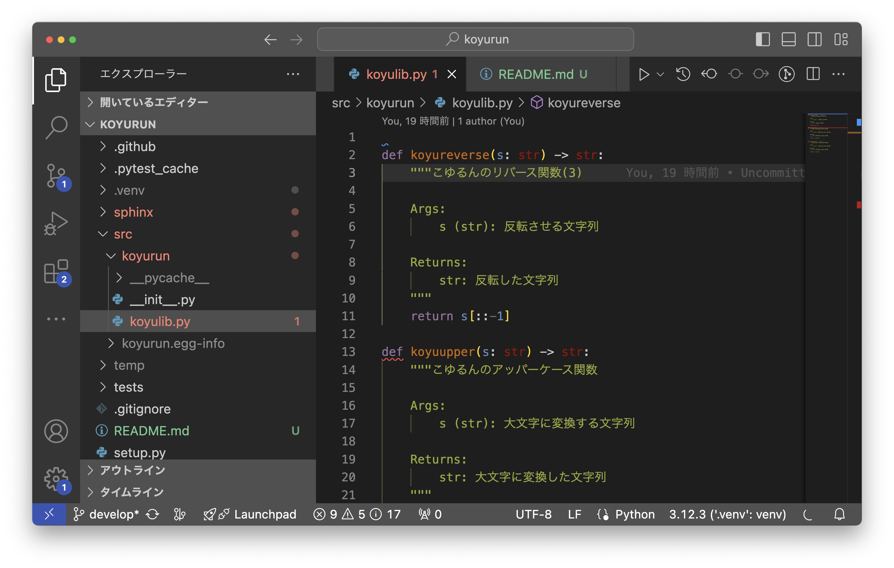

# koyurun

こゆるんライブラリ

## 開発環境構築

### 事前準備（前提）

- VS Code/Dockerをインストールする。
- Docker デーモンを実行済みにする。

### 開発環境起動

- VS CodeにDev Containersの拡張機能をインストールする。
- VS Codeのコマンドパレット（Cmd + Shift + P）を押して、「Dev Containers: Rebuild Without Cache and Reopen in Container」を選択する。
  - あるいは、VS Code左下の「><」ボタンから「Reopen in Container」を選択する。

### Tips

#### 開発コンテナ内から Git を利用する方法

ホストPC側で以下のコマンドを実行する。（秘密鍵は実際に利用しているものを指定する。）

```console
ssh-add --apple-use-keychain ~/.ssh/id_ed25519
```


